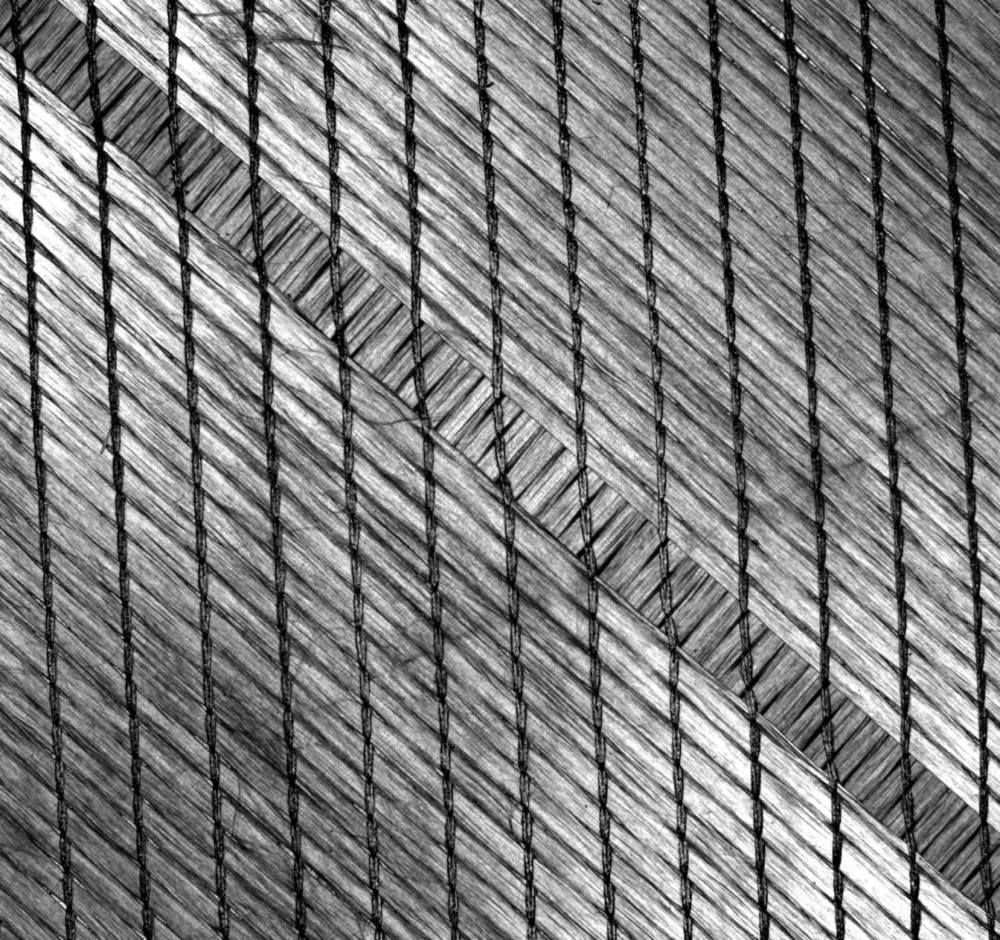
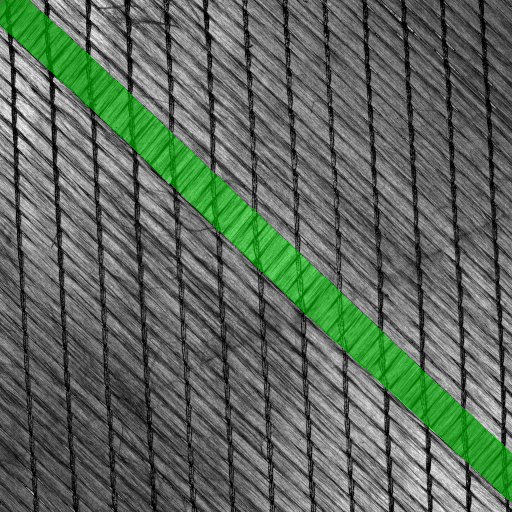
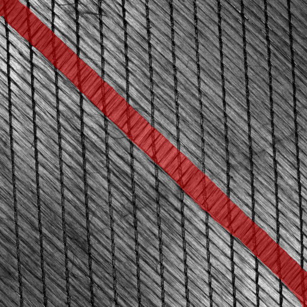
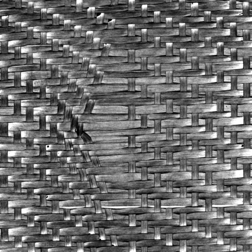
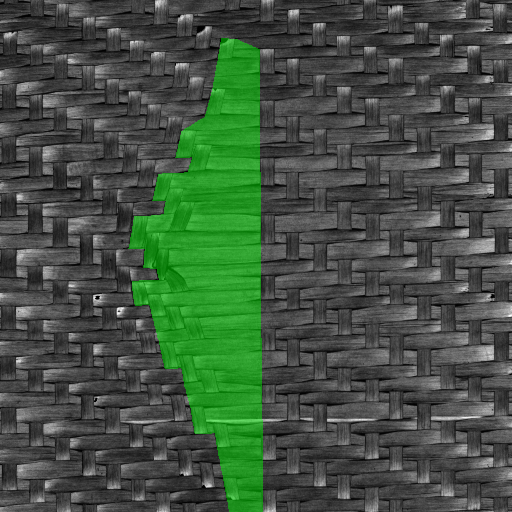
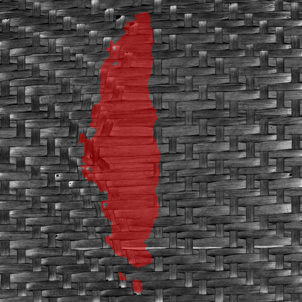
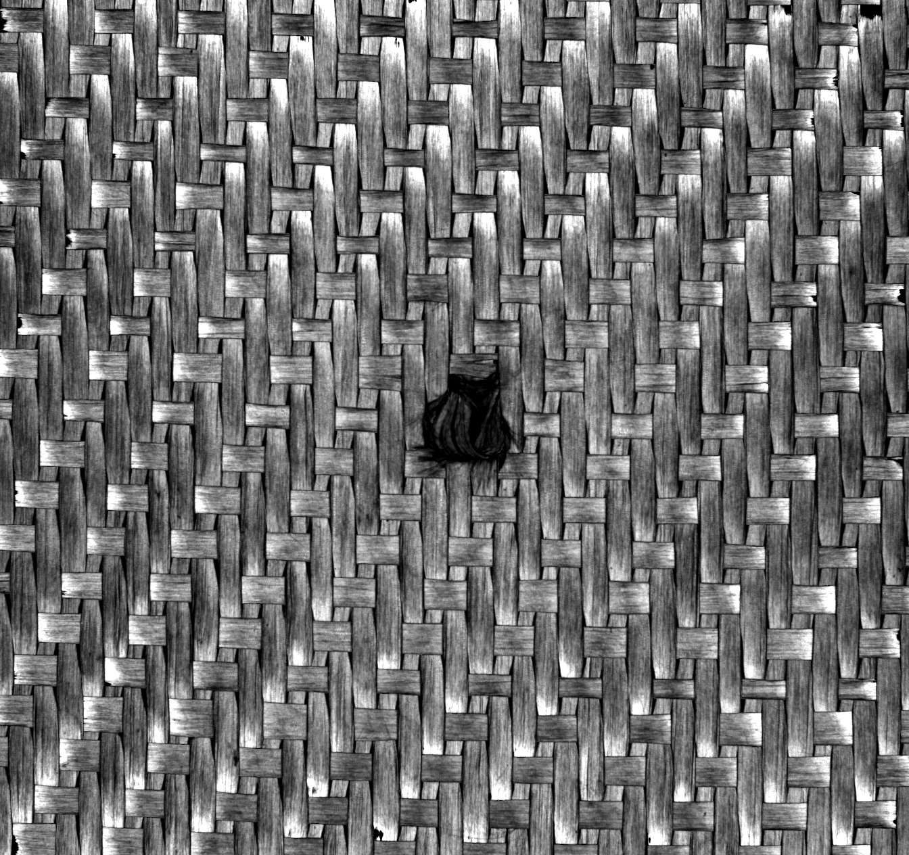
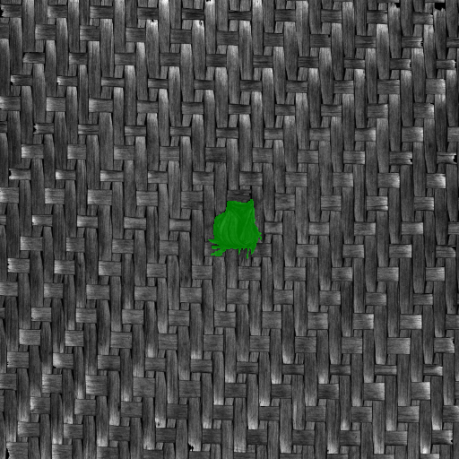
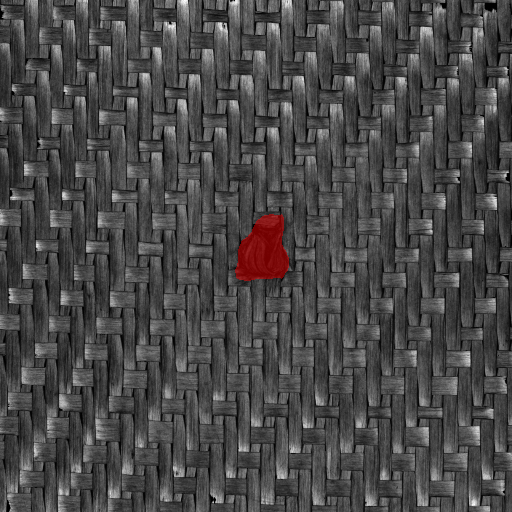

# Deep Learning Pipeline for Carbon-Fibre Defect Segmentation

## Overview

This project investigates the use of deep learning for **pixel-level defect segmentation** in carbon-fibre textile materials under real industrial constraints.

Unlike standard computer vision tasks, this problem involves:
- **multi-channel optical sensor data (F-SCAN)**
- **strong class imbalance (~5% defect pixels)**
- **limited and noisy industrial datasets**
- **highly structured, orientation-dependent textures**

The goal is to develop a robust segmentation pipeline capable of **accurately localizing defects at pixel level**, enabling downstream quality inspection.

---

## Demo & Visual Results

### Qualitative Results (Defect → Ground Truth → Prediction)

  
  
  

  
  
  

  
  
  

> Left: input (fibular / multi-channel visualization)  
> Center: ground truth mask  
> Right: model prediction  

---

## Problem

Carbon-fibre composites are widely used in high-performance industries, but defects such as:
- missing stitches  
- gaps  
- broken tows  
- distortions  
- foreign objects  

can compromise structural integrity.

The task is **semantic segmentation**:
> assign a binary label (defect/background) to each pixel

Compared to classification, segmentation provides:
- precise defect localization  
- geometric information  
- support for automated inspection pipelines  

---

## Industrial Context

The data is acquired using the **F-SCAN sensor**, which captures multiple reflectance modalities.

Each sample includes:
- raw image stack (multi-illumination)
- derived channels:
  - azimuthal (fiber orientation)
  - fibular
  - diffuse
  - specular
  - polar  

These channels encode **physical properties**, not RGB intensities, creating a strong **domain gap with pretrained models**.

---

## Key Challenges

### 1. Data scarcity
- limited annotated samples
- expensive acquisition and labeling process  

### 2. Annotation issues
- inconsistent masks across samples  
- incomplete labels  
- multiple views of same defect → leakage risk  

### 3. Strong class imbalance
- ~95% background pixels  
- small, sparse defects  

### 4. Domain gap
- pretrained models expect RGB  
- input is multi-channel physical data  

### 5. Texture-dominated domain
- defects are **subtle deviations**, not objects  

---

## Dataset & Curation

A new dataset was acquired with:
- **417 samples**
- **58 defect groups**
- **850 annotated instances**
- polygon-based annotations (CVAT)

Key design choices:
- consistent annotation protocol  
- multi-channel inspection during labeling  
- grouping of correlated acquisitions  

### Leakage prevention

Different views of the same defect are grouped and kept in the same split to avoid:
> artificial performance inflation due to memorization

---

## Input Representation

A central contribution of this work is the design of an input pipeline for multi-channel sensor data.

### Channel selection

Instead of RGB:
- selected subsets (e.g. azimuthal + fibular + diffuse)

### Azimuthal normalization

Handled circular nature of angles:
- mapping from [-π, π] → [0,1]
- orientation-based (mod π) normalization to avoid discontinuities  

### Per-sample normalization

Applied per-channel min-max normalization:
- enhances local contrast  
- removes material-specific bias  
- prevents shortcut learning  

---

## Model

### Architecture

- **SegFormer (Transformer-based segmentation)**
- pretrained on ADE20K

Chosen after benchmarking against:
- U-Net
- DeepLabV3 / V3+

SegFormer showed:
- better stability  
- better handling of class imbalance  
- stronger probability calibration  

---

## Training Strategy

### Loss functions

Designed for imbalance:
- Soft IoU / Jaccard loss  
- Focal-based variants  
- Tversky-based losses  

### Data augmentation

- **CutMix adapted to segmentation**
- improves robustness with limited data  

### Evaluation protocol

- group-aware splits  
- Monte Carlo evaluation across seeds  
- global metric aggregation  

---

## Experiments

### Input representation study
- impact of channel combinations  
- normalization strategies  

### Architecture scaling
- SegFormer B0 → B5  

### Loss function comparison
- effect on recall vs precision  

### Comparison with YOLO segmentation
- transformer-based models achieved more stable results  

---

## Alternatives Explored

### Anomaly detection (PatchCore)
- failed due to texture complexity  
- high sensitivity to orientation  

### Self-supervised learning (MAE)
- reconstruction ambiguity  
- unreliable anomaly localization  

Conclusion:
> supervised segmentation remains the most reliable approach in this domain

---

## Key Insights

- **Representation matters more than architecture**
- multi-channel physical data ≠ RGB
- annotation quality is critical for segmentation
- leakage can completely invalidate results
- industrial inspection ≠ standard CV benchmarks

---

## Limitations

- small dataset size  
- domain gap with pretrained models  
- limited generalization across materials  

---

## Future Work

- multi-class defect segmentation  
- domain adaptation techniques  
- integration in real-time inspection pipelines  
- active learning for annotation efficiency  

---

## Technologies

- PyTorch  
- Hugging Face Transformers  
- SegFormer  
- OpenCV  
- CVAT  

---

## Environment

This project depends on proprietary data and acquisition systems (F-SCAN).

The pipeline is reproducible, but full replication requires:
- access to industrial dataset  
- multi-channel sensor data  

---

## Author

Riccardo Fazzi  

Developed during internship at PROFACTOR within industrial research context.
